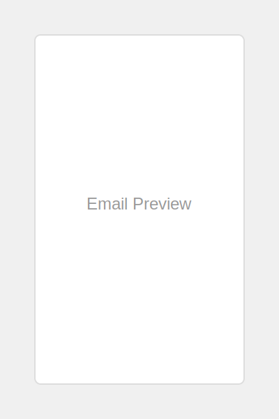

# Email Template Bookshelf

A curated collection of HTML email templates with automatic preview generation and a beautiful browsable interface.



## Overview

The Email Template Bookshelf is a GitHub Pages-powered gallery of professional HTML email templates. It features:

- **Automatic thumbnail generation** - Static and animated GIF previews are created automatically
- **Searchable interface** - Find templates by title, description, or tags
- **Category filtering** - Sort templates by type (Welcome, Newsletter, Promotional, etc.)
- **Detailed template views** - See comprehensive information about each template
- **CMG Demo collection** - Templates featured on College Marketing Group's website

## Repository Structure

```
email-template-bookshelf/
├── docs/                 # GitHub Pages website files
├── scripts/              # Automation scripts
├── templates/            # Email HTML files
└── .github/workflows/    # GitHub Actions automation
```

### Key Components

- **GitHub Pages** - Hosts the template gallery website
- **GitHub Actions** - Automates thumbnail generation and metadata extraction
- **Email Templates** - HTML email files with metadata comments

## Adding a New Template

1. Create your HTML email template
2. Add metadata in an HTML comment (see format below)
3. Place the file in the appropriate templates directory
4. Commit and push to GitHub
5. GitHub Actions will automatically:
   - Generate a static thumbnail
   - Create a scrolling GIF preview
   - Extract metadata
   - Build a detail page

### Template Metadata Format

Add this comment block to the top of your HTML email files:

```html
<!--
METADATA:
{
    "title": "Template Title",
    "description": "Brief description of the template",
    "subjectLine": "Subject line for this email",
    "tags": ["Category1", "Category2"],
    "isCMGDemo": true,
    "fullDescription": "Longer description about this template...",
    "features": [
        {
            "title": "Feature 1",
            "description": "Description of feature 1"
        },
        {
            "title": "Feature 2",
            "description": "Description of feature 2"
        }
    ],
    "designNotes": "Notes about the design choices..."
}
-->
```

## How It Works

1. **Template Storage**:
   - HTML email templates are stored in the `templates/` directory
   - They're organized by category (client, generic, CMG demo)

2. **Thumbnail Generation**:
   - When you push a new template, GitHub Actions triggers
   - `thumbnail-generator.js` creates static thumbnails of each template
   - `scrolling-gif-generator.js` creates animated scrolling previews

3. **Metadata Extraction**:
   - `metadata-generator.js` extracts information from each template
   - It looks for metadata comments and analyzes the HTML content
   - The data is saved to a JSON file for the website to use

4. **Detail Page Generation**:
   - `generate-detail-pages.js` creates individual detail pages for each template
   - These pages show previews, features, and information about the template

5. **Gallery Website**:
   - GitHub Pages serves the website from the `docs/` directory
   - The gallery interface lets users browse, search, and filter templates

## Setup for Local Development

1. Clone the repository
2. Make sure Node.js is installed
3. Install dependencies:
   ```
   npm install puppeteer gifencoder canvas png-file-stream cheerio marked
   ```
4. Add new templates to the templates directory
5. Run scripts manually to test:
   ```
   node scripts/thumbnail-generator.js
   node scripts/scrolling-gif-generator.js
   node scripts/metadata-generator.js
   node scripts/generate-detail-pages.js
   ```

## Credits

Created by [Kade O'Connor](https://kadeoconnor.com).

- Gallery interface uses IBM Plex Sans and IBM Plex Mono fonts
- Email previews generated using Puppeteer, Canvas, and GIFEncoder
- Website built with vanilla JavaScript for maximum performance
